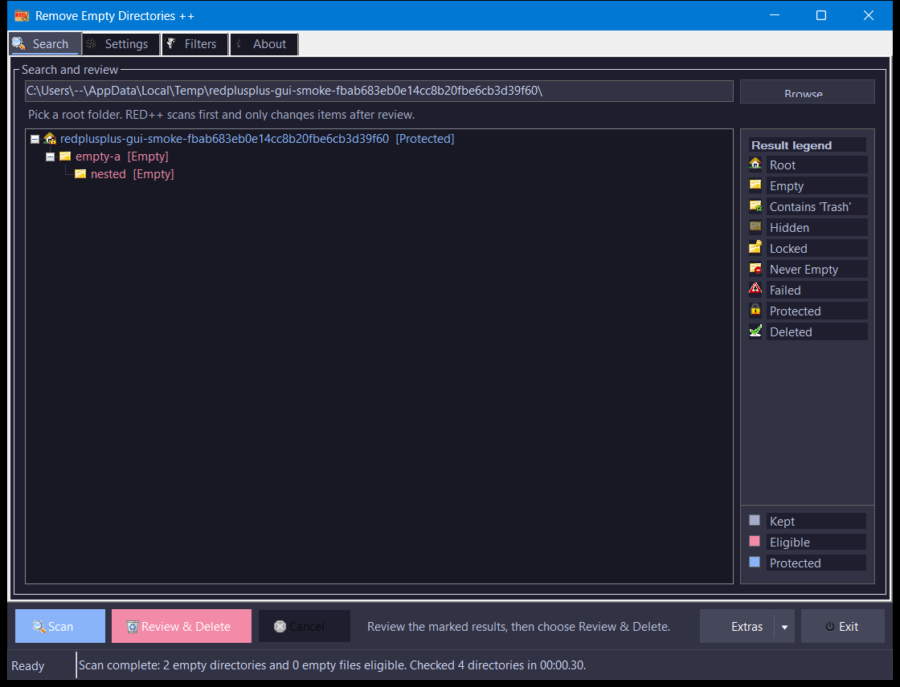

# RED++ : Remove Empty Directories

[Download RED++](https://github.com/SysAdminDoc/REDplusplus/releases)

RED++ finds, displays, and deletes empty directories recursively below a given start folder. Create custom rules for keeping and deleting folders (e.g. treat directories with empty files as empty).



## Features

- Simple user interface with per-monitor DPI awareness
- Shows empty directories before deleting them with confirmation summary
- Supports multiple delete modes (Recycle Bin, Direct, Simulate, Move to folder)
- Allows whitelisting and blacklisting of directories by using filter lists
- Can detect directories with empty files as empty
- Detects OneDrive/cloud-only placeholder files as real content
- Handle-based reparse-point safety (junctions, symlinks, mount points)
- Fully portable (local config file, no %APPDATA% required)
- Extended directory and file name matching with sophisticated filter syntax
- Dedicated grid for display and editing of filter rules
- Translation-ready via .po files (template included, community translations welcome)
- Export scan results to TXT, CSV, or JSON
- Headless CLI mode for scripted/scheduled operation
- Keyboard shortcuts (Enter to scan, Del to delete selected)
- Single-instance enforcement
- Persistent log file (RED++.log)
- Explorer context menu integration
- Environment variable expansion in path input

## Why RED++?

| Feature | RED++ | TreeSize Pro | FolderSizes | Store apps |
|---------|:-----:|:----------:|:-----------:|:----------:|
| Empty-dir scan + preview | Free | ~$50/yr | $60+ | Free |
| Network/UNC share support | Free | Paid only | Paid only | No |
| CLI / Task Scheduler | Free | Paid only | No | No |
| CSV/JSON export | Free | Paid only | Paid only | No |
| Custom filter rules | Free | No | No | No |
| "Select All" results | Free | Free | Free | Paid |
| Portable (no install) | Yes | No | No | No |

## System Requirements

- Windows 10 (version 20H2 or later) or Windows 11
- Microsoft .NET Framework 4.8.1
- No installer required. Unzip and run.

## Usage

### GUI Mode

If the config file (**RED++.cfg**) isn't found, you'll be prompted to create one:
- **Portable Mode** stores the config in the same folder as the executable
- **%APPDATA%** stores the config in a subfolder of Windows %APPDATA%
- If RED++ is in a protected folder (Program Files, etc.), select %APPDATA% instead

### CLI / Headless Mode

```
RED+.exe -silent -path "C:\target" [-log "output.log"]
```

Scans and deletes (per configured delete mode) without showing a window. Writes results to the log file and exits with code 0 (success) or 1 (errors). Useful for Task Scheduler and batch scripts.

Works with UNC paths directly — no mapped drive needed:

```
RED+.exe -silent -path "\\server\share\folder" -log "cleanup.log"
```

### Post-Migration Cleanup

After a `robocopy /MIR` or file-server migration, clean up leftover empty directories:

```
RED+.exe -silent -path "\\server\share" -log "migration-cleanup.log"
```

RED++ handles Thumbs.db and desktop.ini correctly (treats them as ignored files), unlike `robocopy "X" "X" /S /move` which chokes on them.

### Task Scheduler

Create a scheduled task to clean a directory nightly:

```xml
<Actions>
  <Exec>
    <Command>C:\Tools\RED+.exe</Command>
    <Arguments>-silent -path "D:\Shares\Home" -log "D:\Logs\red-cleanup.log"</Arguments>
  </Exec>
</Actions>
```

Exit code 0 = success, 1 = errors occurred. Configure the task to use UNC paths directly — mapped drives are not available in task context.

## Credits

RED++ is based on [RED+](https://github.com/BookOfBeasts/Remove-Empty-Directories-Plus) by [Robert 'NotBob' Bookerby](https://github.com/BookOfBeasts), which is itself based on [RED](https://github.com/hxseven/Remove-Empty-Directories) by [Jonas John](http://www.jonasjohn.de/).

### Icon sources
- Nuvola icons (GNU LGPL 2.1)
- NuoveXT icons (GPL)
- [famfamfam silk icons](https://github.com/legacy-icons/famfamfam-silk) (CC BY 2.5)
- [FatCow free-icons](https://github.com/gammasoft/fatcow) (CC BY 3.0)

## License

RED++ is free software under the [GNU Lesser General Public License v3](http://www.gnu.org/licenses/lgpl.html) or later.
